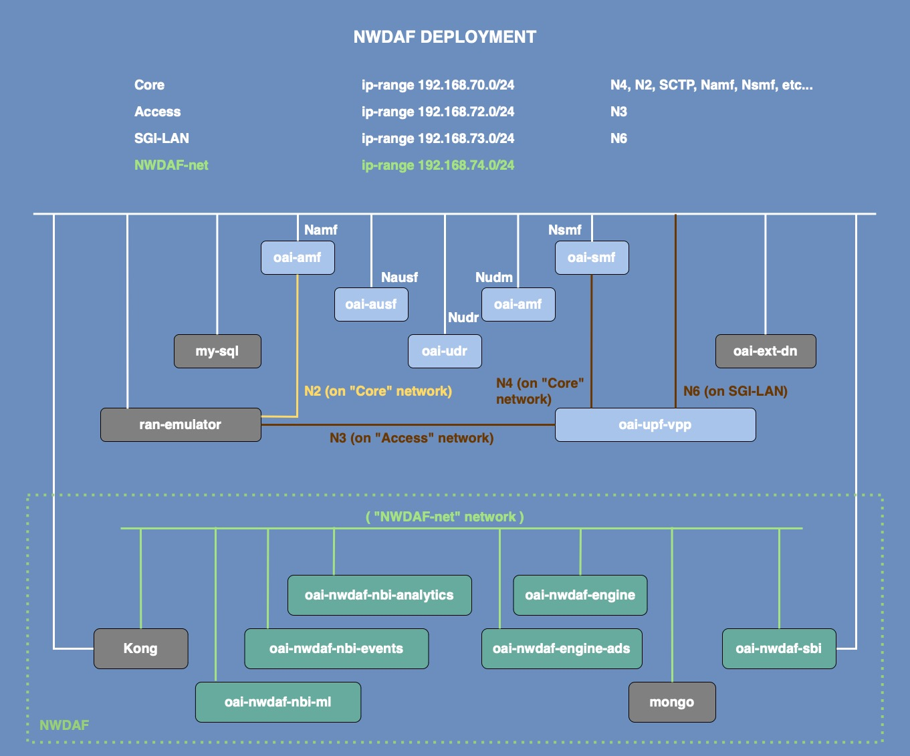

# NWDAF: An implementation of the 5G Network Data Analytics Function.

----------------------------------------------------------

                        NWDAF
An implementation of the 3GPP specifications for the NWDAF.

----------------------------------------------------------

NWDAF is an implementation of the 3GPP specifications for the NWDAF.
It contains:

- NWDAF Analytics Info Service API [**NBI Analytics**]
- NWDAF Events Subscription Service API [**NBI Events**]
- NWDAF ML Model Provision Service API [**NBI Ml**]
- NWDAF Engine [**Engine**]
- NWDAF Engine ADS [**Engine ADS**]
- NWDAF Southbound Interface [**SBI**]

This repository is a **Federation of the NWDAF repositories**.

Its main purpose is to provide documentation and tutorials on how to do a container-based deployment of NWDAF.

## 1. Building NWDAF images

To clone `oai-nwdaf`, run theses commands:

```bash
# clone repo
git clone https://gitlab.eurecom.fr/development/oai-nwdaf.git
# Make sure you are in the oai-nwdaf repository folder.
cd oai-nwdaf
```

Use `--no-cache` flag if you re-build images.

### 1.1. oai-nwdaf-nbi-analytics

```bash
# build the oai-nwdaf-nbi-analytics image
docker build --network=host --no-cache  \
            --target oai-nwdaf-nbi-analytics  --tag oai-nwdaf-nbi-analytics:latest \
            --file components/oai-nwdaf-nbi-analytics/docker/Dockerfile.nbi-analytics.ubuntu \
            components/oai-nwdaf-nbi-analytics
```

### 1.2. oai-nwdaf-nbi-events

```bash
# build the oai-nwdaf-nbi-events image
docker build --network=host --no-cache  \
            --target oai-nwdaf-nbi-events  --tag oai-nwdaf-nbi-events:latest \
            --file components/oai-nwdaf-nbi-events/docker/Dockerfile.nbi-events.ubuntu \
            components/oai-nwdaf-nbi-events
```

### 1.3. oai-nwdaf-nbi-ml

```bash
# build the oai-nwdaf-nbi-ml image
docker build --network=host --no-cache  \
            --target oai-nwdaf-nbi-ml  --tag oai-nwdaf-nbi-ml:latest \
            --file components/oai-nwdaf-nbi-ml/docker/Dockerfile.nbi-ml.ubuntu \
            components/oai-nwdaf-nbi-ml
```

### 1.4. oai-nwdaf-engine

```bash
# build the oai-nwdaf-engine image
docker build --network=host --no-cache  \
            --target oai-nwdaf-engine  --tag oai-nwdaf-engine:latest \
            --file components/oai-nwdaf-engine/docker/Dockerfile.engine.ubuntu \
            components/oai-nwdaf-engine
```

### 1.5. oai-nwdaf-engine-ads

```bash
# build the oai-nwdaf-engine-ads image
docker build --network=host --no-cache  \
            --target oai-nwdaf-engine-ads  --tag oai-nwdaf-engine-ads:latest \
            --file components/oai-nwdaf-engine-ads/docker/Dockerfile.engineAds.ubuntu \
            components/oai-nwdaf-engine-ads
```


### 1.6. oai-nwdaf-sbi

```bash
# build the oai-nwdaf-sbi image
docker build --network=host --no-cache  \
            --target oai-nwdaf-sbi  --tag oai-nwdaf-sbi:latest \
            --file components/oai-nwdaf-sbi/docker/Dockerfile.sbi.ubuntu \
            components/oai-nwdaf-sbi
```

### 1.7. Pull Mongo and kong images

Mongo-DB is used as the database in the NWDAF project.

```bash
docker pull mongo 
```
Kong is an open source API gateway and platform that acts as middleware between NWDAF clients and our API servers (oai-nwdaf-nbi-analytics, oai-nwdaf-nbi-events, oai-nwdaf-nbi-ml).

```bash
docker pull kong
```

### Remove dangling images

```bash
# remove dangling images
docker image prune --force
```

## 2. Network configuration

1. Ensure to have run these commands:

```bash
sudo sysctl net.ipv4.conf.all.forwarding=1
sudo iptables -P FORWARD ACCEPT
```

2. Add to `/etc/hosts` file the following:

```bash
127.1.0.1       oai-nwdaf-nbi-gateway
```

## 3. NWDAF deployment



### 3.1. Starting 5G CN

At the time of writing, we used OAI CN v1.5.1 release. If you require the NWDAF UE_Mobility event, please use the oai-amf:develop version instead of oai-amf:v1.5.1, which does not support location notification.

```bash
# make sure you get out of oai-nwdaf project repository
cd ..
# Clone directly on the v1.5.1 release tag
git clone --branch v1.5.1 https://gitlab.eurecom.fr/oai/cn5g/oai-cn5g-fed.git
```

To deploy OAI 5G Core Network, run:

```bash
# make sure you are in the oai-cn5g-fed/docker-compose project repository
cd oai-cn5g-fed/docker-compose
```

```bash
# you can deploy 5G CN with and without NRF (ie scenarios 1 and 2).
python3 ./core-network.py --type start-basic-vpp --scenario 1
```

**Warning -** If you stop 5G CN (specifically AMF and SMF) while NWDAF is still running, the subscriptions to the network functions will be lost! Every time you restart 5G CN, restart NWDAF to ensure correct behavior.


### 3.2. Starting NWDAF

To start NWDAF components, run these commands:
```bash
# make sure you are in the oai-nwdaf project repository
cd ../../oai-nwdaf
```

```bash
# deploying NWDAF
docker-compose -f docker-compose/docker-compose-nwdaf.yaml up -d --force-recreate
```

## 4. Testing

Once both 5G CN and NWDAF are up, UEs can be connected to test NWDAF features afterwards.

### 4.1. Attaching gnbsim

Make sue you have `gnbsim` image, you can pull a prebuilt docker image as follows:

```bash
# pull gnbsim image
docker pull rohankharade/gnbsim
docker image tag rohankharade/gnbsim:latest gnbsim:latest
```

Now, you can attach a UE by using the `gnbsim-vpp` scenario:

```bash
# first make sure you are in the oai-cn5g-fed project repository
cd ../oai-cn5g-fed
```

```bash
# attaching a UE 
docker-compose -f docker-compose/docker-compose-gnbsim-vpp.yaml up -d --force-recreate
```

### 4.2. Testing NWDAF features

We have implemented the following features for both the Events Subscription API and the Analytics Info API:

- Event: NETWORK_PERFORMANCE
   - Type: Number of connected users (NwPerType: NUM_OF_UE)
   - Type: Session success ratio (NwPerType: SESS_SUCC_RATIO)
- Event: UE_COMMUNICATION
- Event: UE_MOBILITY

In addition to these features, we have also implemented an ML-based feature exclusively for the Events Subscription API:

- Event: ABNORMAL_BEHAVIOUR
  - Exception ID: UNEXPECTED_LARGE_RATE_FLOW

#### 4.2.1 Test Analytics Info API

You can run the `cli` in order to test the Analytics Info Api by following the steps below:

```bash
# make sure you get out of oai-nwdaf/cli repository
cd cli

# run the cli using json files in examples/analytics folder.
python3 cli.py analytics examples/analytics/<json_file_name>
```

You can also generate `curl` commands using:

- [Event_id = NETWORK_PERFORMANCE, NwPerType = NUM_OF_UE.](https://gitlab.eurecom.fr/development/oai-nwdaf/-/blob/main/docs/test_num_of_ue.md)
- [Event_id = NETWORK_PERFORMANCE, NwPerType = SESS_SUCC_RATIO.](https://gitlab.eurecom.fr/development/oai-nwdaf/-/blob/main/docs/test_sess_succ_ratio.md)
- [Event_id = UE_COMMUNICATION.](https://gitlab.eurecom.fr/development/oai-nwdaf/-/blob/main/docs/test_ue_comms.md)
- [Event_id = UE_MOBILITY.](https://gitlab.eurecom.fr/development/oai-nwdaf/-/blob/main/docs/test_ue_mob.md)

#### 4.2.2 Test Event Subscription API

You can run the `cli` in order to test the Events Subscription API by following the steps below:

```bash
# make sure you get out of oai-nwdaf/cli repository
cd cli

# run the cli using json files in examples/subscriptions folder.
python3 cli.py subscribe examples/subscriptions/<json_file_name>
```

#### 4.2.3 3GPP APIs

For more information about 3GPP APIs, you can access specifications via these links: 

- Events Subscription ([editor](https://forge.3gpp.org/swagger/editor-versions/v3.18.0/?url=https://forge.3gpp.org/rep/all/5G_APIs/raw/REL-17/TS29520_Nnwdaf_EventsSubscription.yaml))([UI](https://forge.3gpp.org/swagger/ui/?url=https://forge.3gpp.org/rep/all/5G_APIs/raw/REL-17/TS29520_Nnwdaf_EventsSubscription.yaml))
- Analytics Info ([editor](https://forge.3gpp.org/swagger/editor-versions/v3.18.0/?url=https://forge.3gpp.org/rep/all/5G_APIs/raw/REL-17/TS29520_Nnwdaf_AnalyticsInfo.yaml))([UI](https://forge.3gpp.org/swagger/ui/?url=https://forge.3gpp.org/rep/all/5G_APIs/raw/REL-17/TS29520_Nnwdaf_AnalyticsInfo.yaml))
- Data Management ([editor](https://forge.3gpp.org/swagger/editor-versions/v3.18.0/?url=https://forge.3gpp.org/rep/all/5G_APIs/raw/REL-17/TS29520_Nnwdaf_DataManagement.yaml))([UI](https://forge.3gpp.org/swagger/ui/?url=https://forge.3gpp.org/rep/all/5G_APIs/raw/REL-17/TS29520_Nnwdaf_DataManagement.yaml))
- MLModel Provision ([editor](https://forge.3gpp.org/swagger/editor-versions/v3.18.0/?url=https://forge.3gpp.org/rep/all/5G_APIs/raw/REL-17/TS29520_Nnwdaf_MLModelProvision.yaml))([UI](https://forge.3gpp.org/swagger/ui/?url=https://forge.3gpp.org/rep/all/5G_APIs/raw/REL-17/TS29520_Nnwdaf_MLModelProvision.yaml))

### 4.3. Inspecting oai-nwdaf-database

To see the data stored in `oai-nwdaf-database`, run in terminal (while container running)

```bash
# open mongo console in the container
docker exec -it oai-nwdaf-database mongosh
```

```bash
# upon openning the console, always switch to testing database.
use testing
```

To look up what's in amf collection, run:

```bash
db.amf.find()
```

A typical of *amf collection* entry would be [this](https://gitlab.eurecom.fr/development/oai-nwdaf/-/blob/main/examples/mongo_amf_entry_sample.json).

To look up what's in smf collection, run:

```bash
db.smf.find()
```

A typical of *smf collection* entry would be [this](https://gitlab.eurecom.fr/development/oai-nwdaf/-/blob/main/examples/mongo_smf_entry_sample.json).


## 5. Stopping NWDAF deployment


To stop `NWDAF`, run:
```bash
# make sure you are in the oai-nwdaf project repository
cd ../../oai-nwdaf

# stopping NWDAF
docker-compose -f docker-compose/docker-compose-nwdaf.yaml down
```

To stop the `gnbsim-vpp` container, run:

```bash
# make sure you are in the oai-cn5g-fed project repository
cd ../oai-cn5g-fed

# stopping UE
docker-compose -f docker-compose/docker-compose-gnbsim-vpp.yaml down
```

To stop the `OAI CN`, run:

```bash
# make sure you are in the oai-cn5g-fed/docker-compose project repository
cd docker-compose

# Stop CN
python3 ./core-network.py --type stop-basic-vpp --scenario 1
```